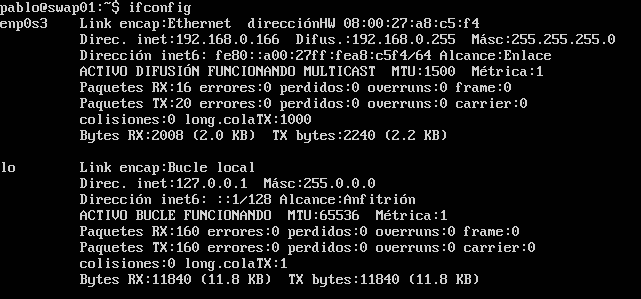
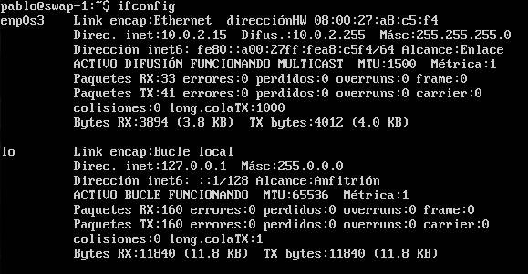
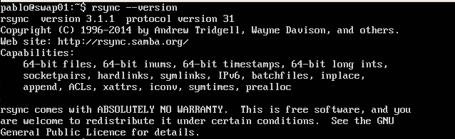
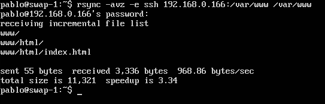
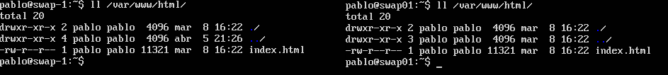
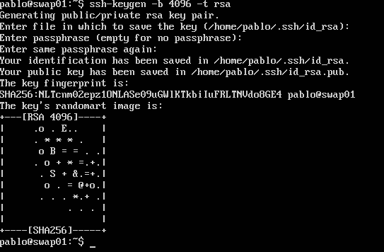
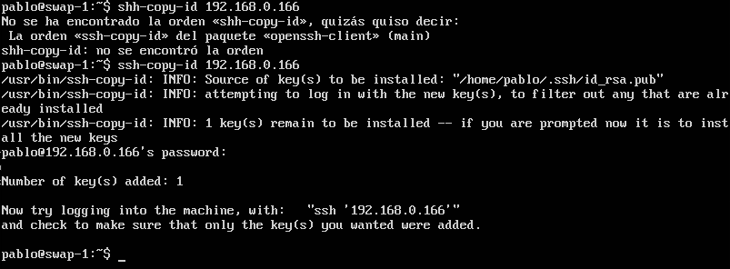
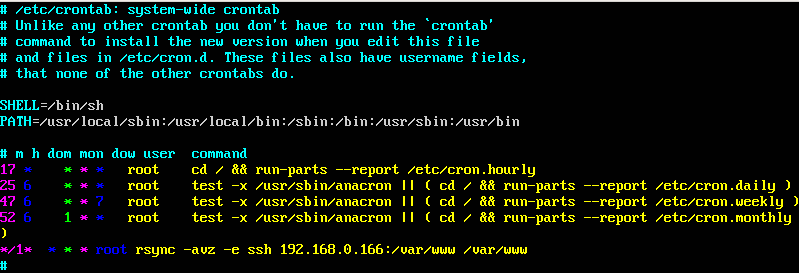

## Práctica 2 - Clonación de la información de un sitio web

**Objetivos** de la práctica : 

- [x] Aprender a copiar archivos mediante ssh
- [x] Clonar contenido entre máquinas
- [x] Configurar shh para acceder a máquinas remotas (sin contraseña)
- [x] Establecer tareas 
- [x] Crear un tar con ficheros locales en un equipo

Para la práctica se emplerán dos máquinas virtuales con Ubuntu Server 

Podemos copiar archivos mediante *ssh* del servidor con IP 10.0.2.15 al servidor con IP 192.168.0.166:

`$ tar czf - prueba_practica_2/ | ssh alum2@192.168.0.204 'cat > ~/prueba_practica_2cp.tgz'`

#### Clonar contenido entre máquinas con rsync

La versión empleada *rsync* ha sido:

Para copiar el directorio */var/www/* del servidor de la máquina empleada como principal a la secundaria, podemos realizar la sincronización desde la máquina secundaria de la siguiente forma:

`$ rsync -avz -e ssh 192.168.0.166:/var/www/ /var/www/`

Dónde *192.168.0.166* es la IP de la máquina principal

Verificamos que se ha realizado la clonación:

#### Configurar ssh para acceder a máquinas remotas sin contraseñas

Debemos generar las claves *RSA* para la comunicación *ssh* mediante `ssh-keygen -b 4096 -t rsa`

Para este ejemplo, se han dejado los parámetros por defecto y debe hacerse en la máquina cliente o **secundaria**, para copiar ahora la clave pública a la máquina principal mediante `ssh-copy-id 192.168.0.166`

#### Establecer tareas con cron. Actualizar el contenido de */var/www/* con `crontab`

Para realizar la tarea, mediante `sudo vim /etc/crontab` modificamos el fichero en la máquina secundaria indicándole que se ejecute cada minuto la sincronización del directorio, para poder comprobar fácilmente que se actualiza. Esto puede realizarse mediante la orden:

`*/1* * * * root rsync -avz -e ssh alum@192.168.0.203:/var/www/ /var/www/` 

