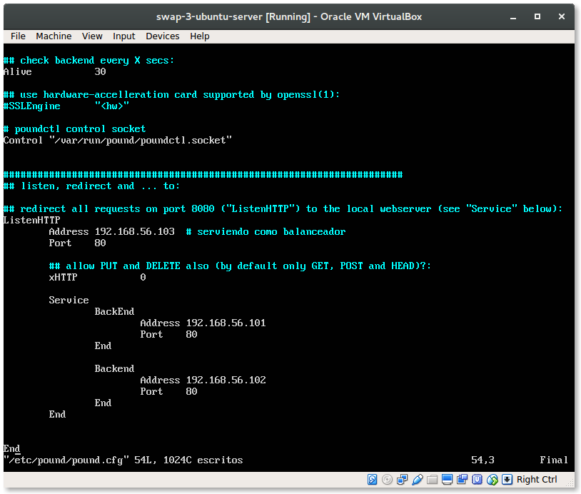

# Práctica 3 - Balanceo de carga 

[TOC]

## Balanceo de carga usando **nginx**

### Balanceador de carga ponderado 

#### Organización de la red

#### 

La máquina 3, con **nginx** como servidor, se emplea como balanceador de carga. Para implementar el algoritmo de balanceo con ponderación se considera que la máquina 1 tiene el doble de capacidad que la máquina 2, para emular que alguna de las máquinas puede ser más potente y puede soportar más tráfico. 

A esta máquina podemos asignarle un peso para el servidor, que por defecto es 1. Este peso indica la carga que le asignamos a esta máquina.  

Modificando el archivo `default.conf` de **nginx** en la máquina balanceador:

```
upstream apaches {
  server 192.168.56.101 weight=3;	# máquina 1
  server 192.168.56.102 			# máquina 2 weight=1 defecto
}
```


Si hacemos un test, vemos com la máquina 1 recibe más carga


## Balanceador de carga con **haproxy**


En primer lugar instalamos `haproxy`

```
$ sudo apt install haproxy
```

 Congifuramos mediante el fichero `/etc/haproxy/haproxy.cfg` indicándo las IP's de las máquinas servidoras. 

> NOTA: En la última versión de *haproxy*  las opciones por defecto *contimeout*, *clitimeout* y *srvtimeout* se han sustituido por *timeout connect*, *timeout client* y *timeout server*.
>
> Más información sobre la configuración [aquí](https://www.haproxy.org/download/1.3/doc/configuration.txt)


Después iniciamos el servicio con el archivo de configuración que hemos creado mediante `sudo /usr/sbin/haproxy -f /etc/haproxy/haproxy.cfg`, cargando el archivo de configuración que hemos creado. Para esta configuración, se ha reescrito la configuración por defecto. 

 

**haproxy** reparte las peticiones entre ambos servidores.


## Balanceador de carga pound

Para la configuración y correcta instalación de *pound* se han consultado los siguientes recursos:

- [How to Configure Load Balancer with Pound (*Youtube*)](https://www.google.es/url?sa=t&rct=j&q=&esrc=s&source=web&cd=4&cad=rja&uact=8&ved=0ahUKEwiTh_fxzdfTAhWKshQKHQC2A9AQtwIIPDAD&url=https%3A%2F%2Fwww.youtube.com%2Fwatch%3Fv%3Ddzpw1SM3uEs&usg=AFQjCNGHenBpGAphGa5Zo7QckJW5H2q2XQ&sig2=8rMXNw53DB8INpfRTmnsqQ)
- [Pound: HTTP Load ](https://www.server-world.info/en/note?os=Ubuntu_16.04&p=pound)

Tras instalar *[pound](http://www.apsis.ch/pound/)* configuramos las máquinas que actuarán como servidores y la máquina usada como balanceador de carga.




Con esta configuración realizamos peticiones desde la máquina local 


## Sometiendo a la granja web a alta carga

Con la herramiento de benchmarking [Apache Benchmark](http://httpd.apache.org/docs/2.2/programs/ab.html) (**ab**) someteremos a los diferentes servidores que actúan como balanceadores a una carga alta. El algoritmo de balanceo será Round Robin. 

En concreto se ha ejecutado ` ab -n 10000 -c 100  http://192.168.56.103/index.html > servidor_ab_resultado.txt`.  Se han realizado 100000 peticiones de 200 en 200, solicitando la página de prueba alojada en nuestro servidor. Los archivos **.txt* se encuentran en este directorio. 

### nginx


Y vemos el fichero resultado 

```
This is ApacheBench, Version 2.3 <$Revision: 1706008 $>
Copyright 1996 Adam Twiss, Zeus Technology Ltd, http://www.zeustech.net/
Licensed to The Apache Software Foundation, http://www.apache.org/

Benchmarking 192.168.56.103 (be patient)


Server Software:        nginx/1.10.0
Server Hostname:        192.168.56.103
Server Port:            80

Document Path:          /index.html
Document Length:        73 bytes

Concurrency Level:      200
Time taken for tests:   70.448 seconds
Complete requests:      100000
Failed requests:        66666
   (Connect: 0, Receive: 0, Length: 66666, Exceptions: 0)
Total transferred:      34166666 bytes
HTML transferred:       7366666 bytes
Requests per second:    1419.49 [#/sec] (mean)
Time per request:       140.896 [ms] (mean)
Time per request:       0.704 [ms] (mean, across all concurrent requests)
Transfer rate:          473.63 [Kbytes/sec] received

Connection Times (ms)
              min  mean[+/-sd] median   max
Connect:        0   42 222.5      0    7161
Processing:     4   98  37.9     93    1714
Waiting:        4   98  37.9     93    1714
Total:          4  140 231.4     94    7236

Percentage of the requests served within a certain time (ms)
  50%     94
  66%    101
  75%    107
  80%    111
  90%    130
  95%    203
  98%   1116
  99%   1143
 100%   7236 (longest request)
```

Como vemos el 100% ha tardado **7236** ms y el test ha tardado 70.48 s en completarser. Sin embargo hemos tenido 66666 peticiones fallidas. 

### haproxy


```
pablo@pablo:~$ cat haproxy_ab_resultado.txt 
This is ApacheBench, Version 2.3 <$Revision: 1706008 $>
Copyright 1996 Adam Twiss, Zeus Technology Ltd, http://www.zeustech.net/
Licensed to The Apache Software Foundation, http://www.apache.org/

Benchmarking 192.168.56.103 (be patient)


Server Software:        Apache/2.4.18
Server Hostname:        192.168.56.103
Server Port:            80

Document Path:          /index.html
Document Length:        74 bytes

Concurrency Level:      200
Time taken for tests:   43.662 seconds
Complete requests:      100000
Failed requests:        49025
   (Connect: 0, Receive: 0, Length: 49025, Exceptions: 0)
Total transferred:      34250975 bytes
HTML transferred:       7350975 bytes
Requests per second:    2290.32 [#/sec] (mean)
Time per request:       87.324 [ms] (mean)
Time per request:       0.437 [ms] (mean, across all concurrent requests)
Transfer rate:          766.07 [Kbytes/sec] received

Connection Times (ms)
              min  mean[+/-sd] median   max
Connect:        0    1  22.8      0    1030
Processing:    20   86  14.0     84     225
Waiting:       20   86  14.0     84     225
Total:         25   87  26.6     85    1133

Percentage of the requests served within a certain time (ms)
  50%     85
  66%     90
  75%     93
  80%     96
  90%    103
  95%    111
  98%    124
  99%    133
 100%   1133 (longest request)
```

### pound

Realizamos el mismo test con *pound* actuando como balanceador


```
pablo@pablo:~$ cat pound_ab_resultado.txt 
This is ApacheBench, Version 2.3 <$Revision: 1706008 $>
Copyright 1996 Adam Twiss, Zeus Technology Ltd, http://www.zeustech.net/
Licensed to The Apache Software Foundation, http://www.apache.org/

Benchmarking 192.168.56.103 (be patient)


Server Software:        Apache/2.4.18
Server Hostname:        192.168.56.103
Server Port:            80

Document Path:          /index.html
Document Length:        73 bytes

Concurrency Level:      200
Time taken for tests:   45.500 seconds
Complete requests:      100000
Failed requests:        49693
   (Connect: 0, Receive: 0, Length: 49693, Exceptions: 0)
Total transferred:      34249693 bytes
HTML transferred:       7349693 bytes
Requests per second:    2197.79 [#/sec] (mean)
Time per request:       91.000 [ms] (mean)
Time per request:       0.455 [ms] (mean, across all concurrent requests)
Transfer rate:          735.10 [Kbytes/sec] received

Connection Times (ms)
              min  mean[+/-sd] median   max
Connect:        0    1   1.5      0      16
Processing:    16   90  15.5     88     302
Waiting:       16   90  15.5     88     302
Total:         20   91  15.6     89     307

Percentage of the requests served within a certain time (ms)
  50%     89
  66%     94
  75%     98
  80%    100
  90%    108
  95%    116
  98%    130
  99%    140
 100%    307 (longest request)
```

### Análisis de los resultados 

Algunas comparaciones entre los diferentes balanceadores: 

Si el % de peticiones servidas en un instante de tiempo en ms obtenemos el siguiente resultado


Vemos que *nginx* es más lento que el más rápido, *pound*. 

También es el que más peticiones falla. 

