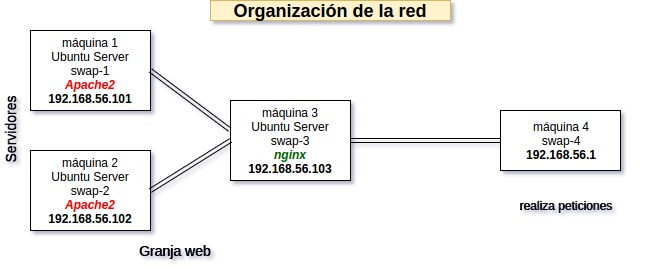
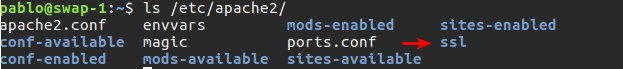
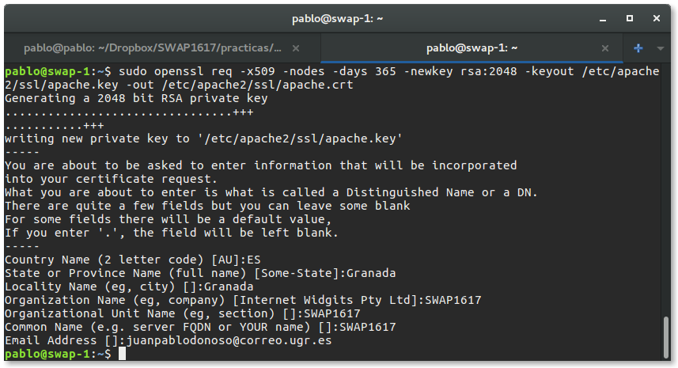
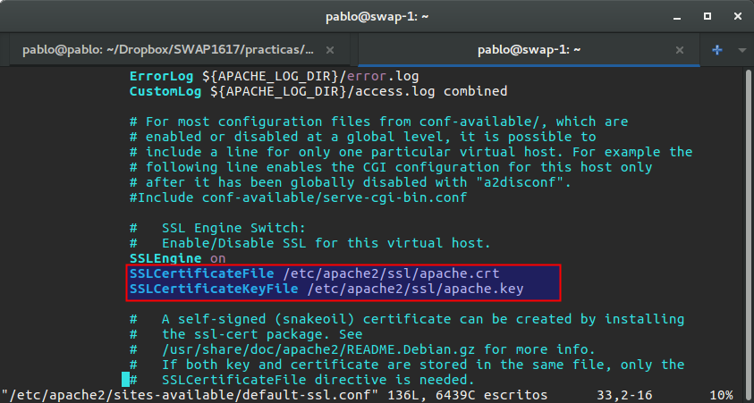
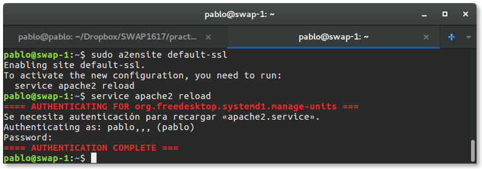
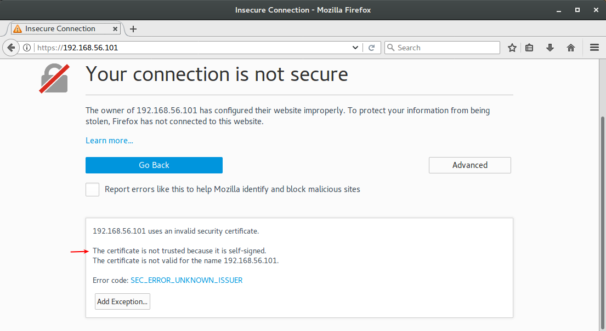
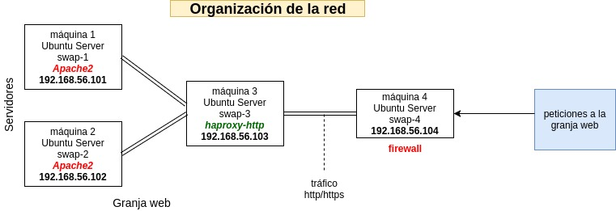
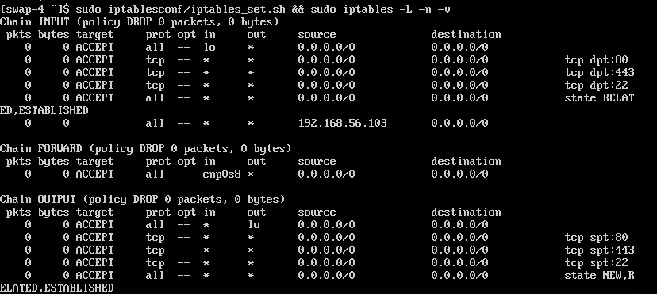
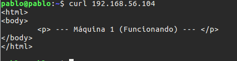

# Práctica 4. Asegurar la granja web 

Objetivos de la praćtica 

- [x] Instalar **certificador SSL** para configurar el acceso HTTPS a los servidores
- [x] Configurar reglas del cortafuegos con **IPTABLES** para proteger granja web, permitiendo acceso por puertos HTTP y HTTPS en una máquina servidora final, automatizado con un script.
- [ ] Instalación de un certificado del proyecto [Certbot](https://github.com/certbot/certbot) en lugar de un certificado automfirmado
- [x] Configuración del cortafuegos en una máquina situada por delantes del balanceador en la organización de la web para hacer el filtrado y posterior reencaminamiento del tráfico hacia el balanceador de carga. 

La configuración del balanceo de carga actual puede consultarse [aquí](https://github.com/juanpablodonoso/SWAP1617/tree/master/practicas/Practica3). 

La granja web actual y que pretendemos asegurar es la siguiente



## Instalación de un certificado autofirmado 

Para generar un certificado autofirmado SSL en Ubuntu server debemos activar el [módulo SSL de Apache](https://httpd.apache.org/docs/2.4/mod/mod_ssl.html) mediante la orden `a2enmod ssl && service apache2 restart`. 

Tras esto será necesario crear la carperta`ssl` donde almacenaremos los certificados de `apache2` en el directorio `/etc/apache2/` 



Una vez creada esta carpeta especificaremos la ruta a los certificados de configuración

```openssl req -x509 -nodes -days 365 -newkey rsa:2048 -keyout
openssl req -x509 -nodes -days 365 -newkey rsa:2048 -keyout 
	/etc/apache2/ssl/apache.key -out /etc/apache2/ssl/apache.crt
```

 Se nos pedirá una información que formará parte del certificado que ha sido completada de la siguiente manera: 



Una vez generados los certificados debemos especificar dónde se encuentra el archivo del certificado y el archivo con la clave `ssl` , en el archivo de configuración `/etc/apache2/sites-avilable/default-ssl.conf`  mediante las siguientes líneas: 

```
SSLCertificateFile /etc/apache2/ssl/apache.crt
SSLCertificateKeyFile /etc/apache2/ssl/apache.key
```



Mediante `a2ensite default-ssl` activamos el default que hemos configurado con la ubicación de los certificados. 



Accediendo al sitio por defecto de nuestro servidor `apache2` veremos que le certificado se encuentra activo pero no es de confianza, ya que es autofirmado



## Crear una máquina que actue como cortafuegos de la granja web 
Se ha creado una máquina llamada **m4** que actuará como cortafuegos habilitando el tráfico http/https. A esta máquina se la ha asignado la IP 192.168.56.104 y por tanto 
la granja web en este momento quedaría de la siguiente forma:



Esta máquina se ha congifurado con el script visto anteriormente para la configuración del cortafuegos con `ipatbles` pero se ha añadido una modificación a este para permitir la redirección a la máquina 3, que actua como balanceador de carga.
Además es necesario permitir el IP Forwarding modificando el fichero de configuración `/etc/sysctl.conf` de tal forma que `net.ipv4.ip_forward = 1`. 
La configuración adicional del cortafuegos es la siguiente:
```
iptables -t nat -A PREROUTING -p tcp --dport 80 -j DNAT --to-destination 192.168.56.103 #1
iptables -A FORWARD --in-interface enp0s8 -j ACCEPT										#2
iptables -t nat -A POSTROUTING --out-interface enp0s8 -j MASQUERADE						#3
```
Con estos cambios permitimos el enrutamiento y especificamos la dirección de reenvío y la interfaz de red que se debe aceptar para realizarlo. En este caso la dirección es la asignada a la máquina balanceadora. 



Ahora realizamos una petición desde la máquina local a la máquina 4 para ver que la reenvía correctamente al balanceador y este a su vez a los servidores finales

 