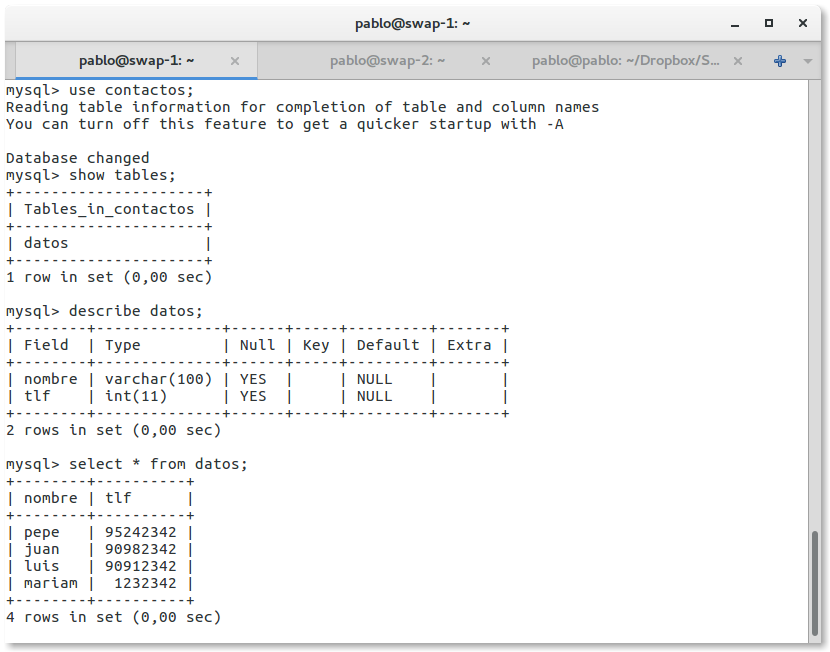
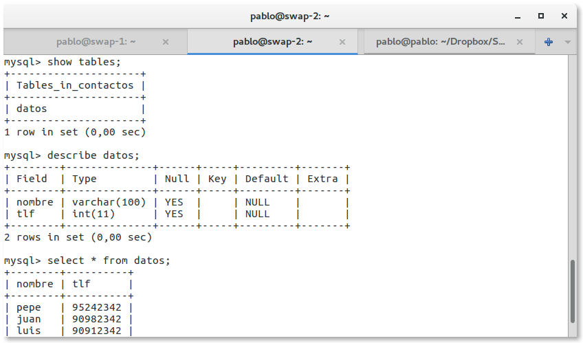
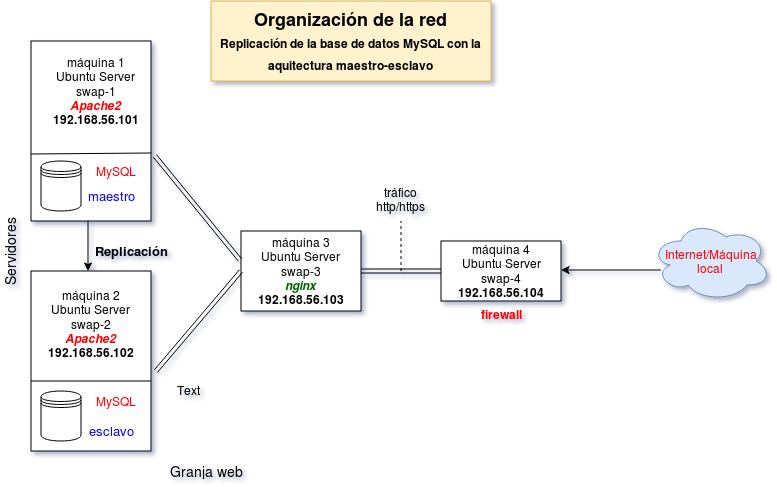
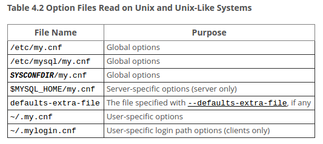

**Cuestiones a resolver**

- [] Crear un DB con tablas y datos 
- [] Realizar una copia de seguridad de DB completa usando mysqldump de la máquina principal
- [] Clonado manual de la base de en la máquina secundaria 
- [] Configuracion maestro-esclavo de los servidores MySQL para que la replicación de la base de datos se haga automáticamente. 
- [] Configuración maestro-maestro de los servidores MySQL 

## Clonación manual de la base de datos

Actualmente la base de datos de nuestro servidor principal tiene el siguiente contenido:



Para generar el dumpfile de la base de datos `contactos` se ha ejecutado el siguiente comando: 
```
mysqldump contactos -u root --password="1234" | ssh 192.168.56.102 mysql -u root --password="1234" contactos
```
> Ver en [explainshell](https://explainshell.com/explain?cmd=mysqldump+contactos+-u+root+--password%3D"1234"+%7C+ssh+192.168.56.102+mysql+-u+root+--password%3D"1234"+contactos)

Es necesario crear previamente la base de datos contactos en la máquina secundaria.
Ahora ya tenemos la base de datos clonada en la maquína secundaria:


## Replicación master-slave de la base de datos

Para evitar la replicación a mano o bien mediante un script que puede fallar o debemos tener cuidado a la hora de lanzarlo, la configuración maestro-esclavo nos permite automatizar la réplica de la máquina principal en la máquina secundaria y así tener una cópia de seguridad en otro servidor. 

Quermos conseguir la siguiente arquitectura:



La configuración del servidor se realizará en los archivos de configuración de `mysql` que podemos ver en la [documentación](https://dev.mysql.com/doc/refman/5.7/en/option-files.html) para la versión 5.7.


### Configuración de mysql maestro 


## Recursos consultados 
- [mysql doc - Command-Line tools ](https://dev.mysql.com/doc/refman/5.7/en/mysql.html)
- [mysql doc - Server Configuration](https://dev.mysql.com/doc/refman/5.7/en/server-configuration.html)
- [mysqldump — A Database Backup Program](https://dev.mysql.com/doc/refman/5.7/en/mysqldump.html)


