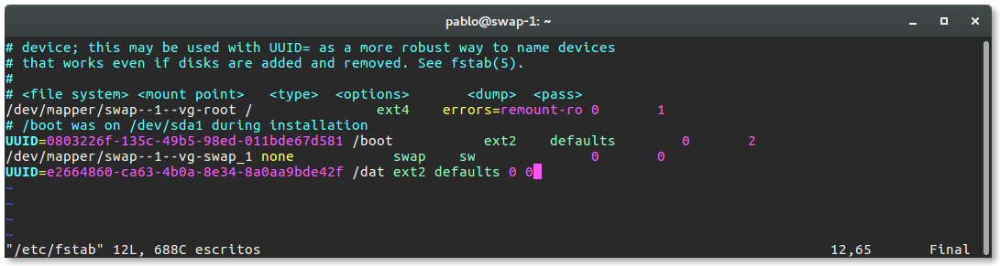
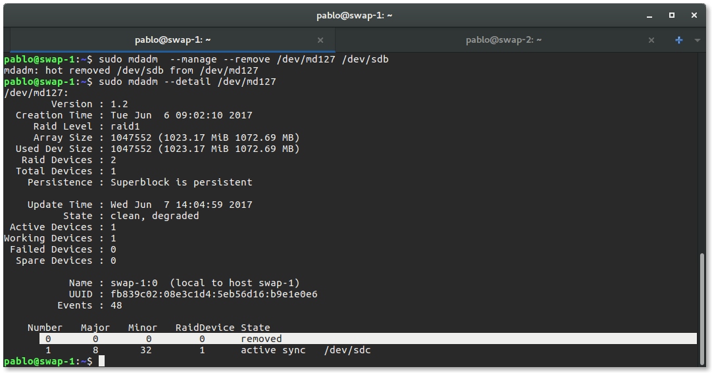

# Prácticas 6 - Discos en RAID 

*Servidor Web de Altas Prestaciones*

*Juan Pablo Donoso*

### Configuración software

El manejo de los discos RAID se realizará mediante la utilidad de disco [mdadm](https://en.wikipedia.org/wiki/Mdadm). Para su instalación usamos ` sudo apt install mdadm`

Los discos creados  mediante el asistente de VirtualBox pueden ser identificados mediante [`sudo fdisk -l`](https://explainshell.com/explain?cmd=sudo+fdisk+-l)

En este caso vemos que corresponde a los discos `/dev/sdc` y `/dev/sdb`. Estos son los discos que usaremos para montar los RAID con [`sudo mdadm -C /dev/md0 --level=raid1 --raid-devices=2 /dev/sdb /dev/sdc`](https://explainshell.com/explain?cmd=sudo+mdadm+-C+%2Fdev%2Fmd0+--level%3Draid1+--raid-devices%3D2+%2Fdev%2Fsdb+%2Fdev%2Fsdc)

Con el comando [`mkfs` ](http://manpages.ubuntu.com/manpages/precise/en/man8/mkfs.8.html) creacmos un sistema de archivos de la siguiente forma:

Si consultamos el manual de [`mkfs`](http://manpages.ubuntu.com/manpages/precise/en/man8/mkfs.8.html) podemos consultar el formato por defecto que tiene este sistema de archivos en función de sus opciones. 

Ahora debemos crear un directorio en el cual montaremos la unidad. Este será el directorio `/dat`. Configuramos mediante `sudo mount /dev/md0 /dat` y montamos con `sudo mount`: 

Realizamos un test para ver que se ha montado correctamente: 

### Automatizar el montaje al boot mediante el UUID de la unidad

Para obtener el [UUID](https://es.wikipedia.org/wiki/Identificador_%C3%BAnico_universal) de la unidad debemos buscarlo en `/dev/disk/by-uuid/`. Como sabemos que debemos buscar `md0` la sentencia `ll /dev/disk/by-uuid/ | grep 'md0'` no mostrará el UUID: 

Este identificador es que el debemos añadir al fichero [`/dev/fstab`] (https://es.wikipedia.org/wiki/Fstab)

El formato ha seguir es el siguiente:

`<dispositivo> <punto_de_montaje> <sistema_de_archivos> <opciones> <dump-freq> <pass-num>`

Al inicio del sistema la orden `sudo mount` deberá montar todos los discos correctamente. 

### Simulación de un fallo y retirada en caliente 

Para similar un fallo en uno de los discos podemos ejecutar la [sentencia](https://explainshell.com/explain?cmd=sudo+mdadm+--manage+--set-faulty+%2Fdev%2Fmd127+%2Fdev%2Fsdb): 

`sudo mdadm --manage --set-faulty /dev/md127 /dev/sdb`

Esto nos permite simular un fallo en el disco `sbd` como vemos mostrando los resultado :

Podemos retirar en caliente el disco en el que hemos simulado el fallo mediante la [sentencia](https://explainshell.com/explain?cmd=sudo+mdadm++--manage+--remove+%2Fdev%2Fmd127+%2Fdev%2Fsdb): 

`sudo mdadm  --manage --remove /dev/md127 /dev/sdb` 

Ahora podemos volver a añadirlo mediante `sudo mdadm  --manage --add /dev/md127 /dev/sdb`

## Configuración NFS

El Network File System es un protocolo para un sistema de archivos distribuido  que nos permite montar directorios remotos en un servidor, pudiendo escribir en el mismo espacio de disco desde diferentes servidores. 

Para realizar la congifugarición se ha seguido los recursos: 

- [How To Set Up an NFS Mount on Ubuntu 14.04 - DigitalOcean](https://www.digitalocean.com/community/tutorials/how-to-set-up-an-nfs-mount-on-ubuntu-14-04)
- [SettingUpNFSHowTo - Ubuntu Community Wiki](https://help.ubuntu.com/community/SettingUpNFSHowTo?action=fullsearch&value=linkto%3A%22SettingUpNFSHowTo%22&context=180)

La configuración que vemos a realizar es la siguiente 

Configuración del servidor **host** 

Intalación del **kernel** para NFS con `sudo apt install install nfs-kernel-server` que nos permita compartir los directorios

