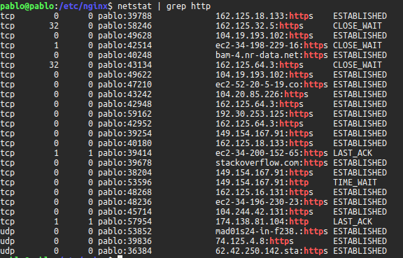
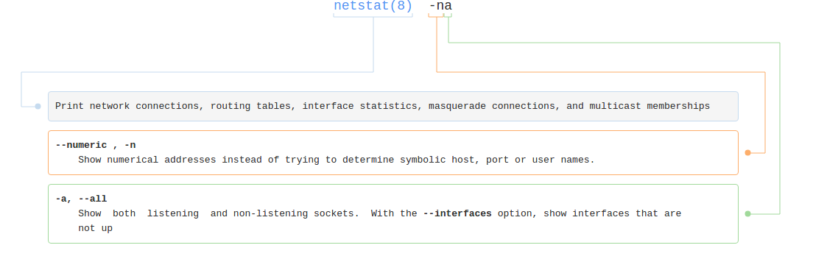
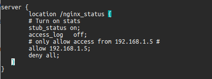
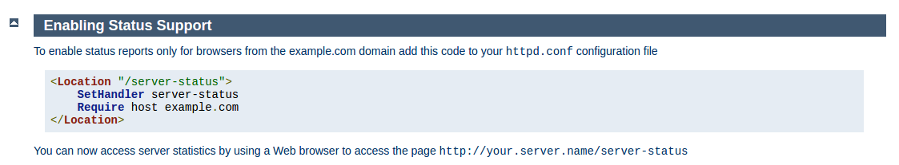
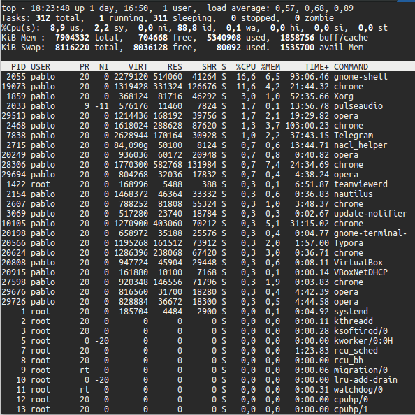
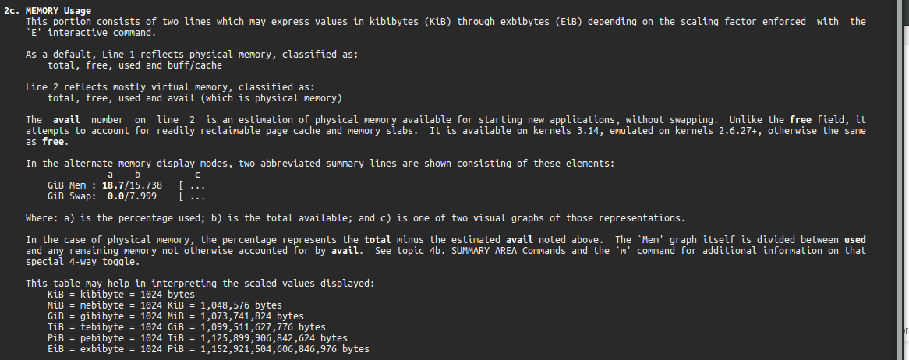
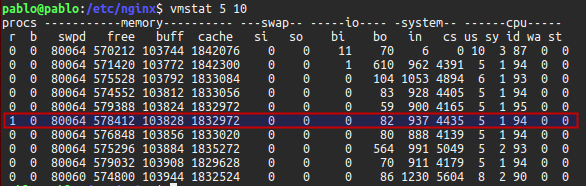

## Tema 5 - Medir las prestaciones 

#### Buscar información sobre cómo calcular el número de conexiones por segundo.

Se han consultado: 

- [nginx: See Active connections / Connections Per Seconds](https://www.cyberciti.biz/faq/nginx-see-active-connections-connections-per-seconds/)
- [serverfault - How do I check hoy many HTTP connections are open currently?](https://serverfault.com/questions/269289/how-do-i-check-how-many-http-connections-are-open-currently)

##### nginx 

Podemos emplear la herramienta [`netstat`](http://www.faqs.org/docs/linux_network/x-087-2-iface.netstat.html) por ejemplo para contabilizar el número de conexiones ` http` con [`netstat | grep http | wc -l `](https://explainshell.com/explain?cmd=netstat+%7C+grep+http+%7C+wc+-l).  La anterior sentencia nos mostraŕa el número total de las conexiones ` http` .



 Podemos variar al parámetro de filtrado de `grep` por ejempo para ver la conexiones por el puerto 80 con `grep :80` . Para que `netstat` nos enseñe todas las conexiones `netstat -na`.




Si tenemos un servidor con `nginx` podemos realizar estadísticas sobre las conexiones al servidor  mediante `stub_status`. El archivo de configuración podría quedar así : 



Tras esto, en `http://192.168.1.5/nginx_status` nos muestra las estadísticas de conexión, como número de conexiones abiertas, manejo de conexión y conexiones aceptadas, algo como esto: 

```
Active connections: 43 
server accepts handled requests
 7368 7368 10993 
Reading: 0 Writing: 5 Waiting: 38
```


##### Apache 

De manera similar podemos modificar el archivo de configuración y activar el módulo [`mod_status`](https://httpd.apache.org/docs/2.4/mod/mod_status.html)



#### Herramientas de análisis. Buscar información sobre características, disponibilidad para diversos SO de herramientas para monitorizar la prestaciones de un servidor. 

- `top`: Es un programa que permite ver en tiempo real los eventos que están ocurriendo en un sistema. Puede mostrar un sumario de la información del sistema como una lista de tareas que actualmente están siendo manejadas por el kernel de Linux.

  

  ` top ` es una herramienta potente y compleja y nos permite obtener una gran información del sistema en función de las parámetros de entrada. Aquí por ejemplo podemos ver la parte `man top` que hace referencia al **uso de memoria**

  

- `vmstat`: Nos da información sobre los procesos, memoria, discos y actividad de cpu. Muy interesante de esta herramienta es la información sobre paginación.

  Algunas opciones:

  ```
  vmstat [-a] [-n] [-t] [-S unit] [delay [ count]]
  vmstat [-s] [-n] [-S unit]
  vmstat [-m] [-n] [delay [ count]]
  vmstat [-d] [-n] [delay [ count]]
  vmstat [-p disk partition] [-n] [delay [ count]]
  vmstat [-f]
  vmstat [-V]
  ```

  Un ejemplo de mi PC con un delay de 5 y 10 actualizaciones, donde vemos por ejemplo cómo un proceso espera para el run time en una de ellas:

  

- `netstat`: Imprime información sobre conexioines, tablas de enrutamiento, estadísticas de las interfaces de red, información de máscaras y multicast. Las opciones de esta herramientas son complejas y se deben consultar [aquí](https://linux.die.net/man/8/netstat).

  ​

  ​