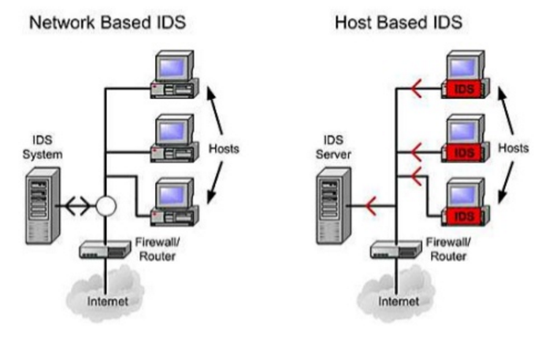
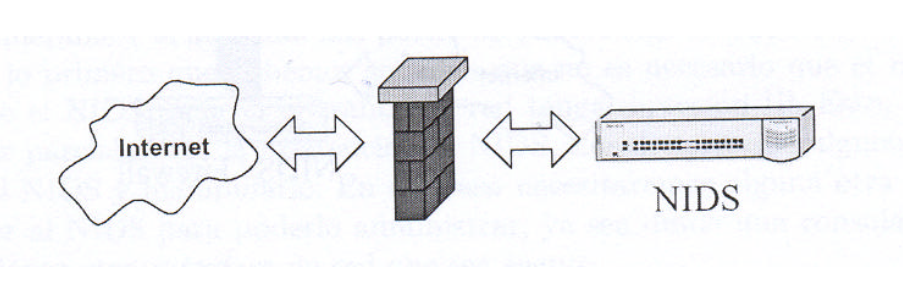
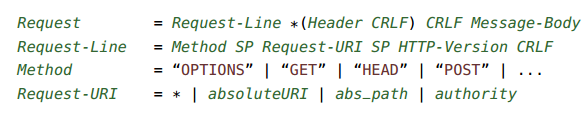

## Sistemas de detección de intrusos (*IDS - Intrusion Detection System*)

Por Juan Pablo Donoso, para la asignatura **Servidores Web de Altas Prestaciones**, del Grado en Ingeniería Informática. 

### Introducción

> En este documento se encuentra una descripcion, clasificación y casos de uso de los distintos sistemas de detección de intrusos asi como el caso de estudio de las técnicas de machine learning empleadas  en los sistemas más sofisticados para la correcta clasificación o anticipación de NIAs. 
>
> También se exponen algunas de las técnicas y herramientas más utilizadas tanto para la sistemas de prevención y detección como para la **vulneración** y **evasión** de estos sistemas. 
>
> Para el desarrollo se referencia contínuamente a [Snort](http://www.snort.org), la herramienta de detección de intrusos empleada. El contenido de la demostración práctica ha sido obtenido, ha excepción de los enlaces consultados descritos, del libro *Intrusion Detection Systems with Snort Advanced IDS Techniques Using Snort, Apache, MySQL, PHP, and ACID*, de  Rafeeq Ur Rehman 

Un *sistema de detección de intrusos* es una herramienta de seguridad encargada de monitorizar los eventos de un sistema en busca de intentos de comprometer la **integridad**, **confidencialidad** y **disponibilidad** del sistema. Estos intentos son los llamados **intentos de intrusión** (NIA - Network Intrusion Attempt). Estos  sistemas pueden centrarse en un tipo de actividad analizada o pueden emplear diferentes métodos, que nos servirán para realizar una clasificación. 

Cuando un NIA es detectado, el IDS lo reporta al administraductor del mismo y en función de su naturaleza, pasiva o activa, intenta detenerlo aunque normalmente estos reportes son centralizados en un Security Information and Event Management system o **SIEM**, normalmente integrados en el sistema y que incorpora un sistema de filtrado de alarmas que permite avisar de los ataques *verdaderos positivos* a la red.

Cada vez que se encuentra un NIA se produce un reporte que es almacenado en un sistema de **logs** que puede ser externo al IDS, com ouna base de datos MySQL. 

Normalmente siguen una metodología basada en la búsqueda de patrones o anomalías en la red y tienen una base de conocimiento para detectar los ataques a la red.

### Tipos de sistemas

Una primera clasificación de este tipo de sistemas puede hacerse en base al **tipo de actividad** que analizan, es decir, a la fuente de información desde la cuál obtener la información o bien al **método de detección** que emplean. 

#### Clasificación en función de la actividad analizada 

##### Sistemas de detección de intrusos en red (Network Bases IDS - NIDs)

Estos sistemas escanean lo paquetes de toda la subred y registran alertas al administrador cuando al comparar un paquete con toda la librería de ataques conocidos existe una coincidencia. Por tanto analizan el flujos de información entre servidores, realizando un sniffing de la red para un compartamiento sospechoso. 

Este tipo de sistemas son los más empleados y a menudo están formados por varios sensores, programados para permanecer en modo oculto y localizados en varios puntos de la red, pudiendo escuchar en un segmento de la misma. 

Los IDSes basados en red requieren que los dispositivos estén configurados en modo *promiscuo*, permitiendo capturar todos los paquetes que pasan por la red. 

En este tipo de sistemas pueden realizarse una gran cantidad análisis y extracción de resultados y características como consecuencia de poder monitorizar todos los recursos de la red, por ejemplo la duración de las conexiones, que puede resultarnos útil para obtener patrones de comportamiento en esta. 

**Ejemplo de localización de NIDS en una red**

Estos sistemas normalmente complementan al *firewall* para detectar los intentos de romperlo.

- NIDS delante del firewall

  Con este posicionamiento podemos comprobar todos los ataques que se produzcan antes de la actuación del firewall y generando una gran cantidad de logs. El firewall bien configurado bloqueará los ataques. 

  

  ​

- NIDS detrás del firewall.

  Este diseño solo monitorizará el tráfico que haya entrado por el firewall en la red, por tanto generará un número de logs inferior pero los ataques detectados serán mucho más peligrosos. 

   

**Ventajas de los NIDs**

- Mínimo impacto en la red. Los sensores son dispositivos pasivos que no interfieren en el tráfico de la red. 
- Los sensores pueden ser hardware o software. Dentro de los múltipos pueden emplearse medidas de virtualización para distribuirlos dinámicamente en función del crecimiento de la red. Esto hace que estos sistemas aseguren redes muy grandes, siendo capaces de monitorizarlas. 

**Desventajas**

- Dificultades con un gran tráfico en la red. 
- Estos sistemas sólo pueden alertar de la intrusión, teniendo que ser el administrador el que investigue en cada host atacado. 
- Puede haber problemas cuando se trate de paquetes fragmentados. 
- Algunos sistemas de servidores no complen los estándaras TCP/IP, pudiendo descartar paquetes que el NIDS ha aceptado. 

##### Sistemas de detección de intrusos basados en Host

#### Clasificación en función del método de detección 

La metodoloǵía seguída para la detección de un *NIA* hace referencia a la fuente de información de la cuál obtener los datos a procesar para clasificar como falso o positivo el ataque. En función de la fuente de la que un IDS puede recoger eventos podemos encontrar:

##### Detección basada en reglas o detección basada en firmas

Este tipo de detección está baso en el matching de una cadena extraída de un paquete de datos del segmento de red  con expresiones o estructuras almacenadas  en una base de conocimiento. 

Las firmas estarán presentes en diferentes partes del datagrama dependiendo de la naturaleza del ataque. Por ejemplo podemos encontrar firmas en la cabecera IP, el la cabecera de la capa de transporte (cabeceras TCP o UPD) y en la cabecera de la capa de aplicación o payload. En IDS como Snort, las firmas son actualizadas por el usuario mientras que en otro tipo de sistemas son responsabilidad del vendedor del software. 

Los sistemas que aplican esta metodología están basados en reglas como base fundamental en su proceso de detección, siendo común la presencia de parsers y analizadores lexicos en estos software. 

En la figura vemos el parse tree de una petición HTTP que nos dará una descomposición de cadenas en las que realizar un matching. Como vemos esta metodología se centra en extraer características de la capa de aplicacioń, cuyos protocolos son gramaticales y pueden contruirse parsers para analizar la información obtenidas de lo segmentos de esta capa. Como ejemplo podemos ver parte de la gramática del protocolo HTTP que define  una petición 

| Signature-bases Detection                | Anomaly-based Detection                  | Stateful Protocol Analysis               |
| ---------------------------------------- | ---------------------------------------- | ---------------------------------------- |
| Proceso de comparación de patrones con eventos capturados para reconocer posibles intrusos | Compara perfiles normales del sistema con eventos observados para reconocer ataques | Dependen de protocolos genéricos desarrollados por la comunidad o vendedores |
| Una signature es un string o patrón que corresponde con un ataque conocido | Una anomalia es una desviación de un comportamiento normal del sistema | El estado indica que el IDS puede conocer y trazar los estados del protocolo (por ejemplo pareando las peticiones con las respuestas) |
| Usa el conocimiento acumulado por ataques específicos y vulnerabilidades de sistema | Los perfiles normales se crean monitorizando el tráfico red en condiciones de no ataque | Los protocolos están basados en estándares desde organizaciones internacionales |

##### Detección basada en anomalías

Este metodología trata de predecir y detectar ataque que no han ocurrido nunca en el sistema que se está protegiendo. Basan su comportamiento en el establecimiento de un comportamiento "normal" de la red y la generación de niveles de anomalías, los cuales se van incrementando según se aleje el evento detectado de la normalidad del sistema. Es un método opuesto al basado en firmas, que solo puede predecir eventos que ya han ocurrido. 

Este método nos permite la deteccion de ataques que antes no estaban detectados en el sistema sin embargo el número de *falsos positivos*  puede ser muy alto, ya que toda información no conocida previamente en el sistema se clasificará como maliciosa. 

Por tanto este tipo de sistemas tienen dos fases, la fase de entrenamiento donde se contruye el perfil de "normalidad" del sistema y la fase de testing donde el tráfico actual de la red es comparado con el perfil creado en la fase de entramiento.  Cuando una anomalía es detectada entra a formar parte de la base de conocimiento, cambiando el estado normal de comportamiento del sistema. 

### Sistemas de detección de intrusos y técnicas de evasión 

### Caso Real - Detección de intrusos con Snort en red propia

##### Snort

