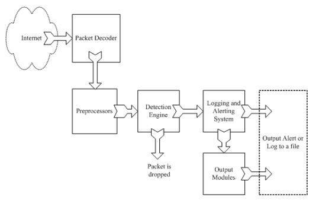
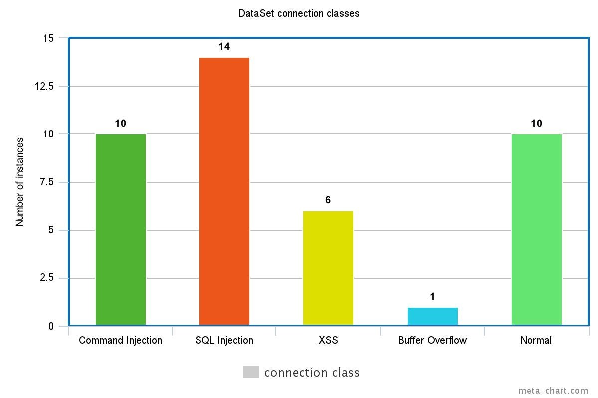

# Sistemas de detección de intrusos
**Juan Pablo Donoso** 
Servidores Web de Altas Prestaciones 


Diapositivas disponibles en github.com/juanpablodonoso/IDS

---
# Definición 
Un Sistema de Detección de Intrusos se engarga de registrar toda la actividad que pueda ser maliciosa en un sistema o red, es decir la cuál amenace la **D**isponibiliad, **C**onfidencialidad e **I**ntegridad de la red. 


Esta actvidad es llamada intento de intrusión (**N**etwork **I**ntrusion **A**ttempt) donde un evento, paquete o agente es un intruso. 

---

# Comportamiento 
Cuando un *NIA* es detectado se produce una **alerta** al administrados del sistema, que pasa a formar parte de un sistema de **logs**. 

El sistema de alertas es el encargado de gestionar falsas alarmas o **falsos positivos**.


---

# Arquitectura (Snort)


---
# Comportamiento (II)
En función del comportamiento del IDS podemos realizar una primera clasificación 

- Actividad analizada 
	- **Basados en red**
	
	- Basado en host
	
- Método de detección 
	- Basados en firmas (*Snort*)
	- Basados en anomalías 


___
<!-- footer: Tipos de sistemas de detección - Detección Basada en Red -->

# Deteción de intrusos basada en red (HIDS)

Analizan segmentos de la subred realizando un matching de los elementos de los paquetes de datos que viajan por la red con una base de datos o reglas.

---

<!-- footer: Tipos de sistemas de detección - Detección Basada en Red -->

# Deteción de intrusos basada en red 
Los dispositivos en este tipo de sisteman han de estar en modo **primíscuo** lo que nos permite analizar todas las conexiones de una forma completa. Por ejempl la duración de las conexiones


---

# Deteción de intrusos basada en red 
Un ejemplo de este tipo de arquitectura podría ser el siguiente


---

# Deteción de intrusos basada en red 
Es el tipo más común, ya que nos permite colocar **sensores** físicos o virtuales en la red, permitiendonos aislar segmentos de esta


---
# Detección de intrusos basada en host


---
# Comportamiento (II)
En función del comportamiento del IDS podemos realizar una primera clasificación 

- Actividad analizada 
	- Basados en red
	
	- Basado en host
	
- Método de detección 
	- **Basados en firmas (*Snort*)**
	- Basados en anomalías 
---

# Métodos de detección 
Los IDS presentan un comportamiento my diferente en función del método de detección de intentos de intrusión.

El método decide qué está bien o qué está mal en nuestra red.

---
<!-- footer: Métodos de deteccion - Detección basada en reglas -->
# Detección basasa en reglas (Signature-based)

Este tipo de detección está baso en el matching de una cadena extraída de un paquete de datos del segmento de red  con expresiones o estructuras almacenadas  en una base de conocimiento. 

---
<!-- footer: Métodos de deteccion - Detección basada en reglas -->
# Detección basasa en reglas (Signature-based)

Las firmas estarán presentes en diferentes partes del datagrama dependiendo de la naturaleza del ataque. Por ejemplo podemos encontrar firmas en la cabecera IP, el la cabecera de la capa de transporte (cabeceras TCP o UPD) y en la cabecera de la capa de aplicación o payload. En IDS como Snort, las firmas son actualizadas por el usuario mientras que en otro tipo de sistemas son responsabilidad del vendedor del software. 


---
<!-- footer: Métodos de deteccion - Detección basada en reglas -->
# Detección basasa en reglas (Signature-based)
**Ejemplo 1 - Parser de protocolo de apliacación**


---
<!-- footer: Métodos de deteccion - Detección basada en reglas -->
# Detección basasa en reglas (Signature-based)
**Ejemplo 1 - Parser de protocolo de aplicación**


---
<!-- footer: Métodos de deteccion - Detección basada en reglas -->
# Detección basasa en reglas (Signature-based)
**Ejemplo 2 - Detección comandos**


`%25%27+0%3D0+union+select+null%2C+table_name+from+information_schema.tables+%23`

---
<!-- footer: Métodos de deteccion - Detección basada en reglas -->
# Detección basasa en reglas (Signature-based)
**Ejemplo 2 - Detección comandos**
`%’ or 0=0 union select null, table_name from information_schema.tables #`

---

<!-- footer: Métodos de deteccion - Detección basada en reglas -->
# Detección basasa en reglas (Signature-based)
**Ejemplo 3 - Detección características en payloads**


---
<!-- footer: Métodos de deteccion - Detección basada en reglas -->
# Detección basasa en reglas (Signature-based) - Dónde están las reglas
Las firmas son establecidas por el proveedor o bien por el usuario en software configurable como Snort en el archivo de configuración


---
<!-- footer: Métodos de deteccion - Detección basada en anomalías -->
# Detección basasa en anomalías
Son sistemas opuestos a los anteriores, ya que intentan proteger al sistema de ataques que no se han producido en el pasado y de los cuales no se tienen datos. Implementan técnicas de Machine Learning


---
<!-- footer: Métodos de deteccion - Detección basada en anomalías -->
# Detección basasa en anomalías
Se componen de una fase de entranamiento en la que se crea un perfil de "normalidad" de la red, seguida de una fase de test donde se realiza la comparativa del estado actual con el estado de entranamiento. 

---

<!-- footer: Métodos de deteccion - Detección basada en anomalías -->
# Detección basasa en anomalías
Nos permiten detectar ataques de los cuales no tenemos datos en nuestra base de conocimiento pero puede haber un gran número de **falsos positivos**, ya que cualquier evento fuera del estado normalidad se clasificará como malicioso


---
<!-- footer: Machine Learning en NID -->
## Aplicación de técnicas de Machine Learning en IDS

###### La aplicación de estas técnicas nos permite clasificar los tipos de ataques e intentar inferir los ataques que estań por llegar. Para ello es necesario un conjunto de entramiento a partir de los datos registrados en ataques previos a nuestra rerd. Con Snort podemos extraer el contenido de nuestra red en texto plano y procesarlo para así poder clasificar estos datos.

---
<!-- footer: Machine Learning en NID -->
## Aplicación de técnicas de Machine Learning en IDS


---
<!-- footer: Machine Learning en NID -->
## Aplicación de técnicas de Machine Learning en IDS



---
<!-- footer: Snort - Introducción -->
# Snort
Snort es un software prevención de intrusos en red, que es capaz de analizar tráfico en tiempo real empleando software como `tcpdump`para el sniffing de paquetes o `flex` y `bison`para el análisis de expresiones dentro de estos paquetes. 


###### *Intrusion Detection Systems with Snort Advanced IDS Techniques Using Snort, Apache, MySQL, PHP, and ACID*, de  Rafeeq Ur Rehman


---
<!-- footer: Snort - Preparando el servidor -->
# Ubuntu Server. Preparación del servidor 


Para instalación detallada (mejor que doc. oficial) 
https://www.upcloud.com/support/installing-snort-on-ubuntu/

---
<!-- footer: Snort - Preparando el servidor -->
# Ubuntu Server. Preparación del servidor 
En todos los servidores donde queramos ejecutar **Snort** debemos tener la siguiente configuración 
**Prerequisitos**
- `build-essential`, `flex`, `bison`
- bibliotecas: `libpcap-dev`,`libpcre3-dev`,`libdumbnet-dev`, `zlib1g-dev` `libdnet`


```sh
# Ubuntu Server 
sudo apt-get install build-essential libpcap-dev libpcre3-dev libdumbnet-dev bison flex zlib1g-dev libdnet
```
Para la configuración de Snort: 
https://www.snort.org/documents/snort-2-9-9-x-on-ubuntu-14-16


---
<!-- footer: Snor -- Funcionamiento -->
# Funcionamiento Snort
## Método de detección 
Snort está basado en reglas, que se emplean para la detección de NIAs. 
Esta regla podría estar alojada en `/etc/snort/rules/sql.rules`


---


---
## Base de datos para logs - Integración Mysql
<!-- footer: Snort - Integración Mysql --->
```
mysql> show tables;
+------------------+
| Tables_in_snort |
+------------------+
| data |
| detail |
| encoding |
| event |
| flags |
| icmphdr |
| iphdr |
| opt |
| protocols |
| reference |
| reference_system |
| schema |
| sensor |
----> [...]
+------------------+
19 rows in set (0.01 sec)
```
---
## Base de datos para logs - Signatures 

<!-- footer: Snort - Integración Mysql --->
```sql
mysql> select * from sig_class;
+--------------+--------------------------+
| sig_class_id | sig_class_name |
+--------------+--------------------------+
| 9 | attempted-recon |
| 8 | misc-attack |
| 7 | bad-unknown |
| 6 | web-application-activity |
+--------------+--------------------------+
4 rows in set (0.00 sec)
```

---

<!-- footer: Snort - Ejemplo de salida estándar -->
# Ejemplo de salida estándar 


